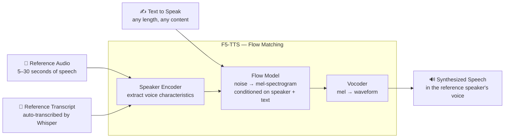
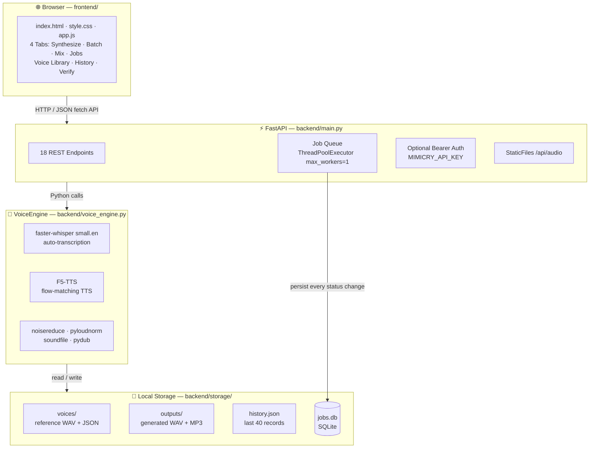
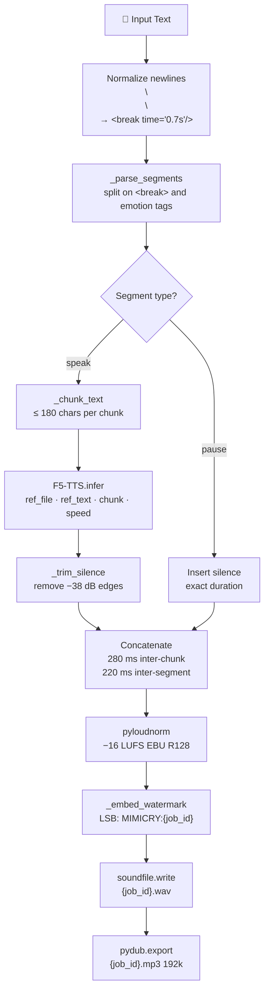
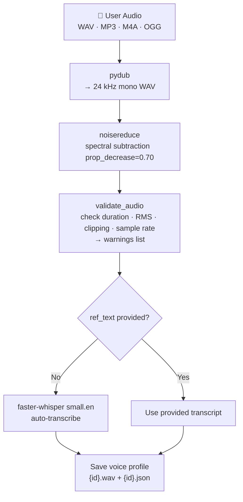
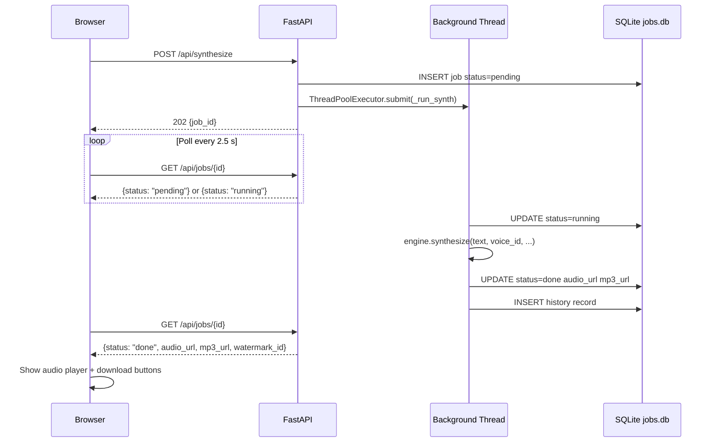
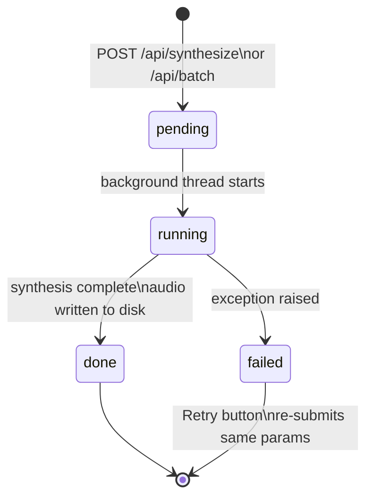
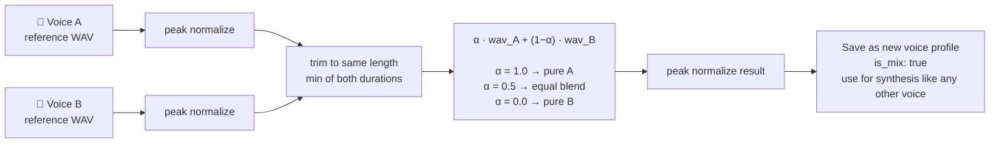
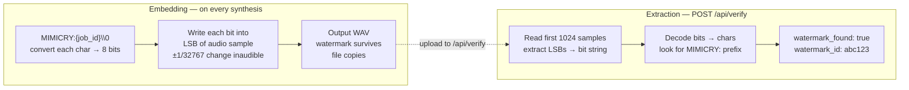

<div align="center">
  

  # 🪞 Mimicry
  **Zero-Shot Voice Cloning & TTS Engine**

  <p align="center">
    <a href="https://python.org/"></a>
    <a href="https://pytorch.org/"></a>
    <a href="https://fastapi.tiangolo.com/"></a>
    <a href="https://github.com/mrigankad/Mimicry/blob/main/LICENSE"></a>
    <a href="https://docker.com/"></a>
  </p>

  <p align="center">
    <em>Upload a 5–30 second audio sample of any person speaking, and generate unlimited new speech in that voice from any text.<br>No training, no GPU required, no cloud dependency. Everything runs locally and privately on your machine.</em>
  </p>
</div>

---


## Table of Contents

- [How Voice Cloning Works](#how-voice-cloning-works)
- [Quick Start](#quick-start)
- [Architecture](#architecture)
- [File Structure](#file-structure)
- [Features](#features)
- [API Reference](#api-reference)
- [Text Features](#text-features)
- [Python SDK](#python-sdk)
- [Docker](#docker)
- [Performance](#performance)
- [Security & Privacy](#security--privacy)
- [Technology Stack](#technology-stack)

---

## How Voice Cloning Works

Traditional TTS requires training a dedicated model for one voice — hours of data, days of compute. Zero-shot cloning skips all of that.

**F5-TTS** (the model Mimicry uses) works via **flow matching**:

1. The model encodes the reference audio into a learned representation of what that speaker sounds like — their timbre, rhythm, accent, breathing pattern
2. It treats speech generation as a diffusion/flow process: starting from noise, it iteratively refines a mel-spectrogram conditioned on both the target text AND the reference speaker signal
3. The reference transcript (`ref_text`) tells the model which parts of the reference audio correspond to which phonemes, giving it a precise phoneme-to-speaker alignment

**Whisper** (faster-whisper small.en) auto-transcribes the reference audio so you never have to type it manually.



---

## Quick Start

### Requirements

- Python 3.10–3.13
- ffmpeg installed and on PATH (for MP3 output)
- ~1 GB free disk space (model weights)

### Install & Run

```bash
# 1. Install Python dependencies
pip install -r requirements.txt

# 2. Start the server (Windows)
start.bat

# Or directly on any OS
python -m uvicorn backend.app.main:app --host 0.0.0.0 --port 8000

# 3. Open in browser
http://localhost:8000
```

**First run** downloads model weights automatically:
- Whisper small.en → ~240 MB
- F5-TTS → ~800 MB

Both are cached in `~/.cache/huggingface/hub/`. Subsequent starts load in ~5 seconds.

### Verify Installation

```bash
python scripts/setup_check.py
```

### With Docker

```bash
docker compose up
# open http://localhost:8000
```

Model weights are cached in a named Docker volume and survive container rebuilds.

### Optional: API Key Auth

Set `MIMICRY_API_KEY` before starting to protect write endpoints:

```bash
# Linux/macOS
MIMICRY_API_KEY=mysecret python -m uvicorn backend.app.main:app --port 8000

# Windows
set MIMICRY_API_KEY=mysecret && python -m uvicorn backend.app.main:app --port 8000
```

Then pass the key in requests:
```
Authorization: Bearer mysecret
```

In the browser, add `?key=mysecret` to the URL once — it is stored in localStorage automatically.

---

## Architecture

### System Overview



### Synthesis Pipeline



### Upload Pipeline



### Job Queue

Synthesis is CPU-bound and takes 15–120 s per request. The queue keeps the server responsive:



### Job State Machine



### Voice Mixing



### Audio Watermark



All job state is written to SQLite on every status change — jobs survive server restarts.

---

## File Structure

```
Voice Cloning/
│
├── backend/
│   ├── app/
│   │   ├── __init__.py
│   │   ├── main.py          # FastAPI app — all routes
│   │   └── voice_engine.py  # VoiceEngine singleton — all AI logic
│   └── storage/             # Auto-created at runtime
│       ├── voices/          # {id}.wav + {id}.json per voice
│       ├── outputs/         # {jobid}.wav + {jobid}.mp3
│       │   └── history.json # Last 40 synthesis records
│       └── jobs.db          # SQLite persistent job store
│
├── scripts/
│   ├── build_release.py     # Release packager
│   └── setup_check.py       # Installation verifier
│
├── docs/
│   └── assets/              # README images
│
├── frontend/
│   ├── index.html           # Single-page app
│   ├── style.css            # Dark UI (CSS custom properties)
│   └── app.js               # All frontend logic (no framework)
│
├── sdk/
│   ├── __init__.py
│   ├── client.py            # Mimicry — sync client (requests)
│   ├── async_client.py      # AsyncMimicry — async client (httpx)
│   └── example.py           # Runnable demo
│
├── Dockerfile
├── docker-compose.yml
├── .dockerignore
├── requirements.txt
└── start.bat                # Windows launcher
```

---

## Features

### Voice Library
- Upload any WAV, MP3, M4A, or OGG clip (5–30 s recommended)
- Drag-and-drop or click to upload
- Whisper auto-transcribes the reference audio
- Optionally provide your own transcript for better accuracy
- Audio validation warns about short clips, low volume, clipping, low sample rate
- Noise reduction applied automatically on upload
- Edit the transcript at any time via the ✏ button
- Preview the reference audio with the ▶ button
- Export voices as portable `.mimicry` files (zip of WAV + metadata)
- Import `.mimicry` files shared by others

### Synthesize Tab
- Select a voice, language (English / Chinese), and speed (0.5×–2.0×)
- Type up to 5000 characters — long text auto-splits into sentence chunks
- Emotion tags adjust speaking style inline (see [Text Features](#text-features))
- SSML `<break>` tags insert precise pauses
- Paragraph double-newlines insert 700 ms natural pauses
- Audio player with waveform animation
- Download as MP3 (small) or WAV (lossless, carries watermark)
- Watermark badge (🔏) shows the embedded ID on every output
- **Ctrl+Enter** to synthesize; **Escape** to close modals
- Retry button on failed jobs

### Batch Tab
- One line of text = one audio clip
- Up to 50 lines per batch
- Real-time per-line progress with status icons
- Download all clips as a ZIP archive

### Mix Voices Tab
- Select two voices and blend them with an α slider
- α=1.0 → pure Voice A, α=0.0 → pure Voice B, α=0.5 → equal blend
- The blend is done at the waveform level (α·wavA + (1-α)·wavB)
- Resulting mixed voice appears in the library and can be used for synthesis

### Jobs Tab
- Table of all synthesis and batch jobs (persisted across restarts)
- Type, status, voice, text preview, speed, age, and play button per job
- Status dots: grey (pending), amber (running), green (done), red (failed)
- Refresh button

### History Panel
- Last 40 synthesis records with voice name, text preview, timestamp
- Play and download each recording
- Watermark ID shown per entry

### Verify Watermark
- Upload any audio file to check if it was generated by Mimicry
- Returns the embedded watermark ID if found
- Works on WAV files (MP3 compression destroys LSB watermarks — use WAV for verification)

---

## API Reference

### Authentication

All write endpoints (`POST`, `PATCH`, `DELETE`) require authentication **only if** the `MIMICRY_API_KEY` environment variable is set on the server.

```
Authorization: Bearer <your-key>
```

### Endpoints

#### `GET /api/status`
```json
{"model_loaded": true, "languages": ["en", "zh-cn"], "version": "5.0.0"}
```

#### `POST /api/voices` — Upload voice
Form data: `name` (string), `audio` (file), `ref_text` (string, optional)

```json
{
  "id": "a1b2c3d4",
  "name": "Alice",
  "duration": 8.4,
  "ref_text": "The quick brown fox jumps over the lazy dog.",
  "warnings": [],
  "audio_url": "/api/voices/a1b2c3d4/audio"
}
```

#### `GET /api/voices` — List voices
Returns array of voice objects.

#### `PATCH /api/voices/{id}` — Update transcript
Body: `{"ref_text": "corrected transcript"}`

#### `DELETE /api/voices/{id}`

#### `GET /api/voices/{id}/audio` — Stream reference WAV

#### `GET /api/voices/{id}/export` — Download `.mimicry` file

#### `POST /api/voices/import` — Import `.mimicry` file
Form data: `file` (`.mimicry` or `.zip`)

#### `POST /api/voices/mix` — Blend two voices
```json
{"voice_id_a": "abc", "voice_id_b": "def", "alpha": 0.6, "name": "Alice×Bob"}
```

#### `POST /api/synthesize` — Enqueue synthesis (202)
```json
{"text": "Hello world", "voice_id": "a1b2c3d4", "language": "en", "speed": 1.0}
```
Returns: `{"job_id": "xyz789", "status": "pending"}`

#### `GET /api/jobs/{id}` — Poll synthesis job
```json
{
  "id": "xyz789",
  "status": "done",
  "audio_url": "/api/audio/xyz789.wav",
  "mp3_url": "/api/audio/xyz789.mp3",
  "watermark_id": "xyz789",
  "voice_name": "Alice",
  "language": "en",
  "speed": 1.0,
  "text_preview": "Hello world"
}
```

#### `POST /api/batch` — Enqueue batch (202)
```json
{"lines": ["Line 1.", "Line 2."], "voice_id": "a1b2c3d4", "language": "en", "speed": 1.0}
```
Returns: `{"batch_id": "...", "total": 2, "status": "pending"}`

#### `GET /api/batch/{id}` — Poll batch
Returns batch job with `items[]` array and `zip_url` when complete.

#### `GET /api/queue` — All jobs (newest first, max 50)

#### `POST /api/verify` — Check watermark
Form data: `audio` (file). Returns:
```json
{"watermark_found": true, "watermark_id": "xyz789", "generated_by": "Mimicry"}
```

#### `GET /api/history` — Last 40 synthesis records

#### `GET /api/audio/{filename}` — Serve output audio

---

## Text Features

### Speed & Emotion Tags

Wrap any text span to change the speaking style for that section only:

| Tag | Effect | Speed multiplier |
|-----|--------|-----------------|
| `[fast]…[/fast]` | Speaks faster | 1.35× |
| `[slow]…[/slow]` | Speaks slower | 0.70× |
| `[whisper]…[/whisper]` | Quiet, breathy | 0.80× |
| `[excited]…[/excited]` | Energetic | 1.20× |
| `[calm]…[/calm]` | Relaxed | 0.85× |

These multiply on top of the global speed slider setting.

**Example:**
```
Welcome everyone. [excited]This is incredible news![/excited]
Let me explain slowly. [slow]First, you need to understand the basics.[/slow]
```

### SSML Break Tags

Insert a precise pause anywhere in the text:

```
First part. <break time="2s"/> Second part after a two-second pause.
```

Supported range: `0.05s` to any duration.

### Paragraph Breaks

Double newlines automatically create a 700 ms natural pause:

```
This is the first paragraph.

This is the second paragraph with a natural gap before it.
```

Single newlines are treated as spaces.

---

## Python SDK

Install dependency: `pip install requests` (sync) or `pip install httpx` (async).

### Sync Client

```python
from sdk import Mimicry

m = Mimicry("http://localhost:8000", api_key="optional-key")

# Upload a reference voice
voice = m.upload_voice("Alice", "alice.wav")
# or with explicit transcript:
voice = m.upload_voice("Alice", "alice.wav", ref_text="What the audio says.")

# Synthesize — blocks until audio is ready, returns bytes
audio = m.synthesize(voice["id"], "Hello from Mimicry!")
open("output.mp3", "wb").write(audio)

# With emotion tags and speed
audio = m.synthesize(
    voice["id"],
    "[excited]Incredible![/excited] Back to normal now.",
    speed=0.9,
)

# Batch synthesis
items = m.batch(voice["id"], ["Line one.", "Line two.", "Line three."])
for item in items:
    print(item["status"], item["audio_url"])

# Download all as ZIP
zip_bytes = m.download_batch_zip(voice["id"], ["Line 1.", "Line 2."])
open("batch.zip", "wb").write(zip_bytes)

# Mix two voices
mixed = m.mix(voice_a_id, voice_b_id, name="Alice×Bob", alpha=0.4)

# Export / import portable voice file
data = m.export_voice(voice["id"])
open("alice.mimicry", "wb").write(data)
restored = m.import_voice("alice.mimicry")

# Verify watermark (WAV files only)
result = m.verify("output.wav")
print(result)  # {"watermark_found": True, "watermark_id": "...", ...}

# History and queue
print(m.history())
print(m.queue())

# Context manager
with Mimicry() as m:
    voices = m.list_voices()
```

### Async Client

```python
import asyncio
from sdk import AsyncMimicry

async def main():
    async with AsyncMimicry("http://localhost:8000") as m:
        # Wait for server to be ready after cold start
        await m.wait_for_model(timeout=300)

        voice = await m.upload_voice("Alice", "alice.wav")
        audio = await m.synthesize(voice["id"], "Hello async world!")
        open("output.mp3", "wb").write(audio)

        # Batch with parallel download
        items = await m.batch(
            voice["id"],
            ["First line.", "Second line."],
            download=True,   # fetches audio_bytes for each item
        )

asyncio.run(main())
```

### SDK Methods

| Method | Description |
|--------|-------------|
| `status()` | Server status and version |
| `wait_for_model(timeout)` | Block until model is loaded |
| `list_voices()` | All saved voice profiles |
| `upload_voice(name, audio, ref_text?)` | Create voice from audio file |
| `delete_voice(id)` | Remove voice |
| `update_ref_text(id, text)` | Correct the reference transcript |
| `export_voice(id)` | Download as `.mimicry` bytes |
| `import_voice(data)` | Restore from `.mimicry` bytes |
| `mix(id_a, id_b, name, alpha)` | Blend two voices |
| `synthesize(id, text, language, speed)` | Generate speech, return bytes |
| `batch(id, lines, language, speed)` | Multi-line synthesis |
| `download_batch_zip(id, lines)` | Batch → ZIP bytes |
| `verify(audio)` | Extract watermark from audio file |
| `history()` | Last 40 synthesis records |
| `queue()` | All active + recent jobs |

---

## Docker

```bash
# Build image
docker build -t mimicry .

# Run with docker compose (recommended — handles volumes)
docker compose up

# Run detached
docker compose up -d

# Rebuild after code changes
docker compose up --build
```

**`docker-compose.yml`** mounts two volumes:

| Volume | Purpose |
|--------|---------|
| `hf_cache` (named) | HuggingFace model weights (~1 GB, survives rebuilds) |
| `./backend/storage` (bind) | Voices, outputs, job history on host disk |

To set the API key in Docker:
```yaml
# docker-compose.yml
environment:
  - MIMICRY_API_KEY=your-secret-key
```

---

## Performance

All timings are approximate on a modern CPU (no GPU):

| Input | Time |
|-------|------|
| 1 short sentence (~15 words) | 15–25 s |
| 1 paragraph (~100 words) | 45–90 s |
| Long text (500 words) | 5–12 min |
| Batch of 10 sentences | ~10× single sentence |

**With a CUDA GPU**: all times drop by roughly 10×. GPU is auto-detected — no configuration needed.

Synthesis runs in a single background thread (`max_workers=1`). Multiple requests queue up and run sequentially. This prevents memory exhaustion on CPU.

---

## Security & Privacy

- **Fully local** — no audio, text, or metadata ever leaves your machine
- **No accounts, no telemetry, no internet required** after first model download
- **API key auth** protects write endpoints when `MIMICRY_API_KEY` is set
- **Audio watermarking** — every generated clip carries a hidden ID (LSB steganography) traceable back to the exact synthesis job via `/api/verify`
  - The watermark survives file copies but **not MP3 compression** — use the WAV file for verification
- **CORS is open** (`allow_origins=["*"]`) — appropriate for local use; restrict in production deployments

---

## Technology Stack

| Component | Library | Version |
|-----------|---------|---------|
| TTS model | F5-TTS (flow matching) | ≥1.1.0 |
| Transcription | faster-whisper small.en | ≥1.0.0 |
| Noise reduction | noisereduce | ≥3.0.0 |
| Loudness normalization | pyloudnorm (EBU R128) | ≥0.1.1 |
| Audio I/O | soundfile + pydub | — |
| Deep learning | PyTorch | ≥2.1.0 |
| Backend | FastAPI + uvicorn | ≥0.110.0 |
| Job persistence | SQLite (stdlib) | — |
| Sync SDK | requests | ≥2.31.0 |
| Async SDK | httpx | ≥0.27.0 |
| Frontend | Vanilla HTML/CSS/JS | — |
| Container | Docker + docker-compose | — |

---

## Build History

| Version | Key additions |
|---------|--------------|
| v1 | Planned with Coqui XTTS v2 → blocked by Python 3.13 incompatibility |
| v2 | Switched to F5-TTS. Basic upload + synthesize + dark UI. Named "Mimicry" |
| v3 | Text chunking, async job queue, ref-text editor modal, history panel, speed slider, silence trimming, audio validator, export/import `.mimicry`, batch synthesis, emotion tags |
| v4 | Voice mixing (α-blend), LSB audio watermarking, 4-tab UI (Synthesize/Batch/Mix/Jobs), Jobs dashboard, Verify watermark modal, queue badge, Docker, Python SDK v1 |
| v5 | GPU auto-detect, Whisper small.en upgrade, noisereduce denoising, pyloudnorm normalization, MP3 output, SSML `<break>` tags, paragraph prosody, SQLite job persistence, API key auth, voice preview button, keyboard shortcuts (Ctrl+Enter / Escape), retry UI, mobile-responsive layout, async SDK |
